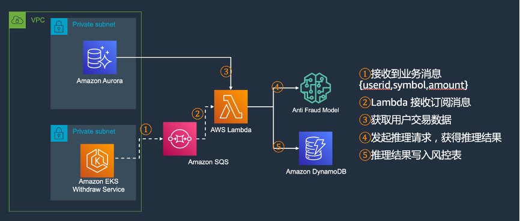

## Anti fraud in Capital Market with Amazon Sagemaker
In Capital Market Industry, there have been incidents of users' securities accounts being stolen, resulting in loss of customer assets. For example, hackers obtained user A's securities account password,then trade many times to buy low and sell high to transfer assets . we implement a solution to detect this kind of fraud actions. The user transaction data is converted into images, and the model training and inference are performed by using the Amazon SageMaker image classification algorithm ResNet, This method of converting transaction data into image classification simplifies the complexity of common feature extraction, and can be used as a new attempt for fraud prevention or user's fraud behavior feature recognition.

This repo includes Training Data process and Sample code of integrating ML inference with Amazon SageMaker.


## Security

See [CONTRIBUTING](CONTRIBUTING.md#security-issue-notifications) for more information.

## License

This library is licensed under the MIT-0 License. See the LICENSE file.


## Step 0: Set up environment
* Python3.9. You need install Python3.9.
* Dependencis. You need to intall following packages.

python -m pip install requests

python -m pip install matplotlib

python -m pip install numpy

python -m pip install opencv-python


## Step 1: Training Data preparation.
1. Pull intraday Kline  from alphavantage.
In this case ,We pull 80 Coinbase's kline data from Alphavantage. You need to get your own Alphavantage APIKey from [Alphavantage website](https://www.alphavantage.co/)

``` python
python generateKline.py
```
2. Generate Hacker's trade records

``` python
python genRandomHackerTrades.py
```


3. Generate Normal users's trade records.

``` python
python genNormal.py
```

4. Turn All trade records to Images.

``` python
python generateNormalImg.py
python generateHackerImg.py
```


## Step 2: Model Training and Deploying
Follow preceding steps ,We get traindata under /traindata. Now let's train our anti-fraud model with Amazon SageMaker image classify algorithm.

1. First you need to  download [im2rec.py](https://github.com/apache/incubator-mxnet/blob/master/tools/im2rec.py),and run command as below d.After that,you will get 2 .lst file named my_data_val.lst and my_data_train.lst.

``` python
 python ./im2rec.py my_data ./traindata --list --recursive --train-ratio .75 --exts .jpg
```

2. Till now ,you have train data  and data index ready. then follow steps in [Image-classification-lst-format-highlevel](https://sagemaker-examples.readthedocs.io/en/latest/introduction_to_amazon_algorithms/imageclassification_caltech/Image-classification-lst-format-highlevel.html),upload *.lst and *.jpg files to  corresponding S3 bucket。

3. When you finish training and deploying model,you get a sagemaker endpoint like antiFraud-imageclassification-ep--2022-05-14-08-14-04 .

## Step 3 (Optional) Business process reference
In the stock exchange, We can select the appropriate trigger timecan for the inferential process. For example, real-time inference when users withdraw money or batch inference every night. We implement the following business processes in a real-time reasoning manner.



1. The application layer send message to AWS SQS.
2. Lambda receive message from AWS SQS,then take user's trading record in 24 hours and take 5 minutes kline data from market database too.With these two kind of data,It generate image of user's behavior pattern.
3. Lambda will call the Amazon Sagemaker endpoint with this jpg file.You will get inference result.If the hacker probability value is greater than 0.90 ,then you can write to your risk control table as a hacker record.

The lambda function code :[imageClassify.py](./lambda/imageClassify.py)

Congratulations!  You have completed the whole anti-fraud experiment.Don't forget to cleanup the resources if you use your own account in this demo.


